# GR00T-compatible observations + dataset collection (minimal sim → Isaac-GR00T)

This doc is the **implementation-facing contract** for logging teleop (keyboard first) so finetuning and eval match **`UNITREE_G1`** / LeRobot expectations. It complements **`manipulation_and_gr00t_plan.md`** §B–E and **`gr00t-g1-wholebody.md`**.

---

## 1. Why `G1GearWBCEnv` is not enough yet

`g1_minimal_sim/g1_gear_wbc_env.py` exposes **minimal Box observations** (qpos/qvel-style summary), not the **dict** GR00T training expects. Teleop still drives **`GearWBCRuntime`** via **`control_dict`** — correct physics path; **obs/action packaging for ML** is an added layer.

---

## 2. Contract: `MODALITY_CONFIGS["unitree_g1"]`

**Source of truth:** `Isaac-GR00T/gr00t/configs/data/embodiment_configs.py`.

| Modality | Keys / notes |
|----------|----------------|
| **video** | `ego_view` (config uses `delta_indices=[0]` — current frame unless you change training config). |
| **state** | `left_leg`, `right_leg`, `waist`, `left_arm`, `right_arm`, `left_hand`, `right_hand`. |
| **action** | Horizon **`delta_indices` 0…29** (30 steps): `left_arm`, `right_arm`, `left_hand`, `right_hand`, `waist`, `base_height_command`, `navigate_command`. Relative vs absolute per group follows **`ActionConfig`** entries in the same file. |
| **language** | `annotation.human.task_description`. |

**Flattened `observation.state` (P3 parquet):** `scripts/export_gr00t_npz_to_lerobot.py` concatenates the seven state groups in the table order into one row vector. With the default G1 + hands slice sizes used here, that is **6 + 6 + 3 + 7 + 7 + 7 + 7 = 43** floats. A list length of **43** in dataset viewers (e.g. Hugging Face) is therefore **expected**, not a mismatch with `unitree_g1`.

**Training data format:** LeRobot-style dataset on disk (see **`gr00t/data/dataset/lerobot_episode_loader.py`**): `meta/info.json`, `meta/episodes.jsonl`, `meta/modality.json`, `meta/stats.json`, episode parquet + video files. Official Apple-to-plate example dataset path (sparse checkout): Hugging Face **`nvidia/PhysicalAI-Robotics-GR00T-X-Embodiment-Sim`** → `unitree_g1.LMPnPAppleToPlateDC`. Use its **`meta/`** as a **template** for column names and shapes; recompute **stats** from your data.

**Finetune recipe (reference):** `Isaac-GR00T/examples/GR00T-WholeBodyControl/finetune_g1.sh` — base **`nvidia/GR00T-N1.6-3B`**, **`--embodiment_tag UNITREE_G1`**, **`max_steps` / `global_batch_size`** as in script; scale GPUs for your budget.

---

## 3. MJCF: “same robot” vs “same scene”

- **Robot asset lineage:** Stylish diner + hands scenes use the **vendored G1 bundle** (`GR00T-WholeBodyControl/.../sim2mujoco/resources/robots/g1/`, meshes via `meshdir` in merged MJCF). Joint topology matches the **Gear WBC** stack used elsewhere.
- **Not identical to RoboCasa Apple-to-plate:** **`LMPnPAppleToPlateDC`** composes a **RoboCasa** kitchen + apple + plate — different world than **`g1_gear_wbc_stylish_diner_hands.xml`**. Proprio **can** align if **`RobotModel`** joint grouping matches; **vision will not** match Apple demos unless you replicate their camera extrinsics and scene.

**Implication:** Finetune/eval on **your** logged **`ego_view`** + **your** scene for milestone tasks (cube → table). Mixing Apple DC pixels with diner pixels without domain adaptation is a separate decision.

---

## 4. Video / camera (critical)

- **Minimal sim hands MJCF** includes a fixed robot camera, e.g. **`head_pov`** on the head link (`pos="0.10 0 0.52"`, `fovy="110"` in merged stylish_diner hands XML — verify in current file).
- **WholeBodyControl eval** (`gr00t/eval/rollout_policy.py` → `get_groot_locomanip_env_fn`) uses RoboCasa camera names such as **`robot0_oak_egoview`** — **not** the same mount / intrinsics as **`head_pov`** by default.
- **SyncEnv** (`GR00T-WholeBodyControl/.../sync_env.py`) exposes camera tensors as keys ending in **`_image`** and duplicates **`video.<name>`** for eval.

**Rule for compatibility:** Pick **one** ego camera definition for **recording + eval + resolution** (e.g. always render **`head_pov`** offscreen at **W×H** chosen to match your dataset template — confirm against reference **`meta/info.json`**). Document **`W×H`, dtype, and naming** in the exporter so **`modality.json`** matches **`LeRobotEpisodeLoader`**.

---

## 5. Building observations (recommended wiring)

**Reuse upstream helpers** from **`GR00T-WholeBodyControl`**:

1. **`RobotModel`** via **`get_robot_type_and_model`** with the same **`robot_name`** / **`enable_waist`** as eval (`rollout_policy` uses **`enable_waist=True`** for locomanip).
2. Build full configuration **`q`** (and velocities if needed) in **model joint order**. **`SyncEnv.observe()`** shows the pattern: actuator-order body/hand arrays → **`get_configuration_from_actuated_joints`**, then **`prepare_observation_for_eval`** in **`gr00t_wbc/control/utils/n1_utils.py`**, which adds **`state.left_arm`**, **`state.right_arm`**, … **`state.right_hand`**.
3. Set **`obs["annotation.human.task_description"]`** (episode-level string or fixed instruction).
4. Render MuJoCo **`mjv_updateScene` / `mjr_render`** (or env `render` with **`rgb_array`**) from the **chosen ego camera**; store under the same keys your **LeRobot modality map** expects (often mapped from **`observation.images.ego_view`** in datasets — see **`gr00t_wbc/data/utils.py`** mapping tables).

**Implemented in-repo (P1):** **`g1_minimal_sim/gr00t_observation_builder.py`** — **`mujoco_q_to_robot_model_q`** reads each named hinge joint from MuJoCo into **`RobotModel.dof_index`** order; **`Gr00tObservationBuilder.build`** calls **`prepare_observation_for_eval`**, sets **`annotation.human.task_description`**, and (if **`include_video=True`**) renders **`head_pov`** via **`mujoco.Renderer`** as **`ego_view_image`** + **`video.ego_view`** (**uint8** RGB). Default resolution **640×480** matches **`RS_VIEW_CAMERA_*`** in WholeBodyControl; override **`image_width` / `image_height`**. **Headless note:** **`mujoco.Renderer`** needs a GL context (**DISPLAY**, **`MUJOCO_GL=egl`**, or OSMesa); CI pytest covers **state-only** **`include_video=False`** (`tests/test_gr00t_observation_builder_smoke.py`).

---

## 6. Logging actions (must match policy + WBC)

Eval applies **`WholeBodyControlWrapper`**, which uses **`concat_action(robot_model, action)`** → **`navigate_cmd`**, **`base_height_command`**, **`target_upper_body_pose`** for **`G1GearWbcPolicy`**.

For supervised learning, each logged step should store the **same structured action** the policy outputs (after any teleop→IK→joint conversion), not raw keycodes:

- **`navigate_command`** (3), **`base_height_command`** (scalar),
- **`left_arm` / `right_arm` / `left_hand` / `right_hand` / `waist`** in **joint space** per **`embodiment_configs`**,

**P2 logger default:** `extract_gr00t_action_dict` / `Gr00tTeleopEpisodeLogger` use **`relative_arm_actions=True` by default**, so **`action.left_arm` / `action.right_arm`** in NPZ are **deltas vs current `state.left_arm` / `state.right_arm`** — matching **`ActionRepresentation.RELATIVE`** for those two keys in `embodiment_configs`. Other logged action groups follow the same absolute/relative split as upstream (e.g. hands and waist **absolute**).

**time-aligned** with observations at the **control timestep** (typically **50 Hz** in the upstream stack — confirm **`control_freq`** / your step dt).

Chunk **30-step** action horizons for training to match **`unitree_g1`** action **`delta_indices`** unless you change the config consistently in train **and** eval (**`n_action_steps`** in **`rollout_policy`**).

> **🔥 ACTIVE BUG (May 2026).** The detailed wiring contract for `action.*` (relative-vs-absolute arms, plan-cadence substepping, waist → torso FK, hand-joint permutation, leg-pose init contract), the inference-side diagnostics (`--debug-policy-prints`, `--replay-npz`, `--arm-action-mode`, `--no-apply-waist`, `--no-permute-hands`, `--plan-hz`, `--video-fps`, `--no-clip-arm-targets`), the visual / language distribution-shift audit (camera / hands rgba / task description), and the numerical policy I/O A/B dump protocol (with `policy_ab_dump.py` + `scripts/run_policy_ab_dump.py` interpretation matrix) all moved into **[`ACTIVE_gr00t_inference_wiring.md`](ACTIVE_gr00t_inference_wiring.md)** §6 / §7 / §8 / §9 while the qualitative apple-to-plate test is still failing. Read that file before debugging inference. The end-to-end pipeline map below (§6.4) stays here as the durable "what gets logged / trained / inferenced" reference.

### 6.1–6.3 → moved to ACTIVE doc

Detailed contracts for **arm action representation** (relative vs absolute, server-side `unapply_action` absolutization, per-branch resolver), **inference-side diagnostics** (`--debug-policy-prints`, `--replay-npz`, `--arm-action-mode`, `--no-apply-waist`, `--no-permute-hands`, `--plan-hz`, `--video-fps`, `--no-clip-arm-targets`, `--policy-ab-dump`), and **plan-cadence substepping** (`n_substeps = round(1/(plan_hz * sim_dt))`) — including the four compounding bug writeups (#1 replay-rep, #2 dtype-cast, #3 cadence, #4 live double-add) — live in **[`ACTIVE_gr00t_inference_wiring.md`](ACTIVE_gr00t_inference_wiring.md)** (§6 per-key wiring, §8 closed bugs, §9 diagnostic tools). After the qualitative apple-to-plate exit criterion in §1 of that file is met, the durable contract bits will graduate into `systemPatterns.md` and stay pinned by `tests/test_run_gr00t_inference_cadence.py`.

### 6.4 End-to-end pipeline map (teleop → dataset → training → inference)

**Goal:** Anything that defines “what the model saw” on disk must match “what the model sees” at minimal-sim inference, modulo intentional domain shift (scene pixels). This section is the **single canonical map** for locking that pipeline; **`scripts/run_gr00t_inference.py`** (same code as `run_gr00t_stylish_diner_inference.py`) is the minimal-sim inference entrypoint once the policy server is up. **Shipped apple-to-plate eval** (RoboCasa `LMPnPAppleToPlateDC`) uses **`gr00t/eval/rollout_policy.py`** — see **`techContext.md`** § “OG apple-to-plate reference eval (Tier A)”.

**Debugging minimal-sim vs Isaac-GR00T:** For **PnP apple/plate** checkpoints, compare **`rollout_policy`** on `LMPnPAppleToPlateDC_G1_gear_wbc` to **`run_gr00t_inference.py --scene table_pnp`** with the **same** server + weights — **not** `stylish_diner`. Same task family; MJCF/camera still differ from RoboCasa, so alignment iteration (camera, builder, prompts) is expected when A works and B does not. Framed in **`techContext.md`** § “Canonical PnP A/B”.

```mermaid
flowchart LR
  subgraph collect [Data collection]
    T[Teleop / runtime]
    T --> L[Gr00tTeleopEpisodeLogger sample_hz]
    L --> D[(NPZ / LeRobot parquet + video)]
  end
  subgraph train [Training]
    D --> P[Processor normalize + relative_action apply]
    P --> M[Model]
    M --> C[(Checkpoint + processor_config.json)]
  end
  subgraph infer [Inference minimal sim]
    Mu[MuJoCo + GearWBCRuntime]
    Mu --> B[Gr00tObservationBuilder]
    B --> H[History stacks per modality]
    H --> PC[PolicyClient flat obs]
    PC --> S[run_gr00t_server PolicyServer]
    S --> Dec[decode_action + unapply_action]
    Dec --> A[action.* chunk]
    A --> App[_apply_action_step → control_dict]
    App --> Mu
  end
  C --> S
```

**Training-side chain (one logged timestep ≈ one plan period \(1/\texttt{sample\_hz}\)):**

| Step | What happens |
|------|----------------|
| Physics | Teleop updates `control_dict`; `GearWBCRuntime` steps MuJoCo at `simulation_dt` with internal decimation; logger **samples** at **`Gr00tTeleopEpisodeLogger.sample_hz`** (default **50 Hz**). |
| Observation | Builder → `prepare_observation_for_eval` → flat **`state.*`** groups + ego **`video.*`** + **`annotation.human.task_description`**. |
| Action on disk | **`extract_gr00t_action_dict`**: arms **relative** by default (`target − state`); hands / waist / loco / height **absolute** per `embodiment_configs`. |
| Dataset | NPZ → (optional) LeRobot export; columns + **`meta/stats.json`** feed the trainer. |
| Trainer | **`launch_finetune.py`** sets **`use_relative_action=True`**; processor applies its own relative transform + normalization; checkpoint stores **`processor_config.json`**. |

**Inference-side chain (must mirror semantics, not necessarily RoboCasa binaries):**

| Step | What happens |
|------|----------------|
| Physics | Same runtime; inference loop holds PD targets **\(n\_\text{substeps}\)** `mj_step`s per **plan step** so simulated time per policy row matches **`1/plan_hz`** (cadence contract → [`ACTIVE_gr00t_inference_wiring.md`](ACTIVE_gr00t_inference_wiring.md) §6/§8 "bug #3 plan-cadence"). |
| Observation | **Same builder** + **same modality keys/horizons** as returned by **`PolicyClient.get_modality_config()`** (stack `(B,T,D)` / `(B,T,H,W,C)`). |
| Wire format | Client sends **flat** keys (`video.ego_view`, `state.left_arm`, …). Server must run **`run_gr00t_server.py` with `--use-sim-policy-wrapper`** so **`Gr00tSimPolicyWrapper`** nests dicts for **`Gr00tPolicy`** (without wrapper, policy expects nested `observation["video"][...]`). |
| Policy | **`Gr00tPolicy._get_action`**: processor → model → **`processor.decode_action(..., state=batched_states)`** → **`StateActionProcessor.unapply_action`** (RELATIVE arm keys → **absolute** joint targets using **the same state history** passed through the processor). |
| Robot command | Client receives **`action.*`** `(B,T,D)`; script indexes time within chunk; **`--arm-action-mode auto`** → **absolute** on live for arms (derivation → [`ACTIVE_gr00t_inference_wiring.md`](ACTIVE_gr00t_inference_wiring.md) §6 / §8 bugs #1+#4); writes **`loco_cmd`**, **`height_cmd`**, **`arm_target_q`**. |

**Alignment checklist (easy to miss):**

| Contract | Training / checkpoint | Inference |
|----------|------------------------|-----------|
| Embodiment | **`UNITREE_G1`** modality in `embodiment_configs.py` | Server **`--embodiment-tag`** matches checkpoint |
| Flat vs nested obs | LeRobot rows ↔ processor | **`--use-sim-policy-wrapper`** + flat keys from diner script |
| State layout | `RobotModel` joint grouping + stats | **`Gr00tObservationBuilder`** + same **`prepare_observation_for_eval`** path |
| `decode_action` reference | Uses **batched state** inside **`Gr00tPolicy._get_action`** | If **`state.*` floats diverge** from training semantics, RELATIVE→absolute arms decode **wrong** even when shapes match |
| Language key | **`annotation.human.task_description`** | Policy obs uses **exact** key from **`get_modality_config()`** |
| Hands | **`action.left_hand` / `action.right_hand`** absolute on disk in `RobotModel` sorted-DoF (index→middle→thumb) order | Bridge **permutes** to MuJoCo qpos tree (thumb→middle→index) before PD write; **default on** (Fix B); regression guard `--no-permute-hands` |
| Waist → torso | **`action.waist`** absolute joint targets on disk (yaw, roll, pitch per `MODALITY_CONFIGS["unitree_g1"]`) | Bridge runs the **same Pinocchio FK** as `G1DecoupledWholeBodyPolicy.get_action` (Fix A) and writes `(roll, pitch, yaw)` into `rt.control_dict["rpy_cmd"]`; regression guard `--no-apply-waist` + one-time WARN when chunk omits `action.waist` |
| Video playback | N/A | One MP4 frame per **plan step**; default **`--video-fps`** follows **`--plan-hz`** so wall-clock matches training footage |

**Pointers:** server **`Isaac-GR00T/gr00t/eval/run_gr00t_server.py`**; nested decode **`gr00t/policy/gr00t_policy.py`** (`_get_action`), **`gr00t/model/gr00t_n1d6/processing_gr00t_n1d6.py`** (`decode_action`), flat shim **`Gr00tSimPolicyWrapper`** in same file; tests **`g1_minimal_sim/tests/test_run_gr00t_inference_cadence.py`**.

---

### 6.5 / 6.6 / 6.7 → moved to ACTIVE doc

**Visual / language alignment** (egoview camera, hand rgba, task description), the **leg-pose init contract** (Bug #8, `default_angles` seeding in `__init__` + `reset()`), and the **numerical policy I/O A/B dump protocol** (`policy_ab_dump.py` + `scripts/run_policy_ab_dump.py` harness, interpretation matrix) live in **[`ACTIVE_gr00t_inference_wiring.md`](ACTIVE_gr00t_inference_wiring.md)** (§6/§7 per-key wiring, §8 closed Bug #8, §9 diagnostic tools, §10 next experiments). Tests still pinned by `tests/test_runtime_leg_default_pose.py`, `tests/test_policy_ab_dump.py`, and the table-PnP MJCF / task / camera tests in `tests/test_run_gr00t_inference_cadence.py`.

---

## 7. Export pipeline (phases)

| Phase | Deliverable |
|-------|-------------|
| **P0** | Script: load MJCF + **`RobotModel`**, print **`state.*` shapes** vs reference dataset modality lengths. **Implemented:** `g1_minimal_sim/scripts/validate_gr00t_unitree_g1_shapes.py` (pytest: `tests/test_validate_gr00t_unitree_g1_shapes.py`). Run with Isaac-GR00T WholeBodyControl venv: ``../Isaac-GR00T/gr00t/eval/sim/GR00T-WholeBodyControl/GR00T-WholeBodyControl_uv/.venv/bin/python scripts/validate_gr00t_unitree_g1_shapes.py --waist-ik --mujoco-nq --hands`` (from `g1_minimal_sim/`). |
| **P1** | **`ObservationBuilder`** or env wrapper: dict obs + fixed-res ego **`rgb_array`**. **Implemented:** **`gr00t_observation_builder.py`** (**`Gr00tObservationBuilder`**). Tests: **`test_gr00t_observation_builder_smoke.py`** (state headless). |
| **P2** | **Teleop logger**: step loop → obs + policy-format action + timestamps; episode boundaries. **Implemented:** **`gr00t_teleop_logger.py`** (`extract_gr00t_action_dict`, `Gr00tTeleopEpisodeLogger`, `save_npz` → stacked arrays + `episode_000_metadata.json`). **`play_g1_gear_wbc.py`**: `--gr00t-record-dir`, `--gr00t-task`, `--gr00t-record-video` (does not override logger kwargs — **relative arms default applies**). Tests: **`tests/test_gr00t_teleop_logger.py`**. **Arms:** NPZ stores **relative** `left_arm`/`right_arm` by default (see §6). **P3 export:** **`scripts/export_gr00t_npz_to_lerobot.py`** has optional **`--relative-arms`** (off by default): use it only if NPZ still has **absolute** arm targets; **do not** combine with default P2 logs or you **double-subtract** state. |
| **P3** | **LeRobot export** from NPZ → dataset dir (`export_gr00t_npz_to_lerobot.py`); **`LeRobotEpisodeLoader`** smoke load (`scripts/smoke_load_lerobot_dataset.py`); optional **`launch_finetune`** dry run. |
| **P4** | **Eval parity:** same builder + **`WholeBodyControlWrapper`** + **`MultiStepWrapper`** (or register a Gym id mirroring **`get_groot_locomanip_env_fn`** if you lift minimal sim into the same factory pattern). |

---

## 8. Optional milestones (user roadmap)

- **Milestone 1:** Keyboard teleop in stylish diner + hands; short walk → grasp cube → turn → place on **nearby blue table**; **fixed** instruction string; dataset **A**.
- **Later:** Harder variants (cup, table farther toward kitchen) as **separate dataset dirs** or task ids so language / stats stay clean.

---

## 9. File pointers (quick)

| What | Where |
|------|--------|
| Modality config | `Isaac-GR00T/gr00t/configs/data/embodiment_configs.py` |
| `prepare_observation_for_eval` | `GR00T-WholeBodyControl/.../n1_utils.py` |
| `SyncEnv.observe` | `GR00T-WholeBodyControl/.../sync_env.py` |
| WBC wrapper | `GR00T-WholeBodyControl/.../n1_utils.py` → **`WholeBodyControlWrapper`** |
| Client env factory | `Isaac-GR00T/gr00t/eval/rollout_policy.py` → **`get_groot_locomanip_env_fn`** |
| LeRobot loader | `Isaac-GR00T/gr00t/data/dataset/lerobot_episode_loader.py` |
| Example finetune | `Isaac-GR00T/examples/GR00T-WholeBodyControl/finetune_g1.sh` |
| Example README | `Isaac-GR00T/examples/GR00T-WholeBodyControl/README.md` |
| Inference server CLI | `Isaac-GR00T/gr00t/eval/run_gr00t_server.py` — use **`--use-sim-policy-wrapper`** + **`embodiment_tag`** matching checkpoint |
| Policy decode path | `Isaac-GR00T/gr00t/policy/gr00t_policy.py` (`Gr00tPolicy._get_action`, `Gr00tSimPolicyWrapper`); `gr00t/model/gr00t_n1d6/processing_gr00t_n1d6.py` (`decode_action`) |
| Minimal sim inference bridge | `g1_minimal_sim/scripts/run_gr00t_stylish_diner_inference.py` (cadence + arm mode + tests in `tests/test_run_gr00t_inference_cadence.py`) |
| Minimal sim P1 builder | `g1_minimal_sim/gr00t_observation_builder.py` |
| Phase 3 numerical A/B | `g1_minimal_sim/policy_ab_dump.py` (`dump_policy_roundtrip_pack`); CLI `--policy-ab-dump` on both `Isaac-GR00T/gr00t/eval/rollout_policy.py` and `g1_minimal_sim/scripts/run_gr00t_stylish_diner_inference.py`; tests `tests/test_policy_ab_dump.py`. Protocol: [`ACTIVE_gr00t_inference_wiring.md`](ACTIVE_gr00t_inference_wiring.md) §9. |
| Phase 3 one-command harness | `g1_minimal_sim/scripts/run_policy_ab_dump.py` (`--run-id`, `--diff-only`, `--state-atol`); colourised per-key diff table; exits non-zero on `state.*` / `action.*` regression. Protocol: [`ACTIVE_gr00t_inference_wiring.md`](ACTIVE_gr00t_inference_wiring.md) §9 "One-command harness". |
| Leg-pose init contract | `gear_wbc_stand.GearWBCRuntime.__init__` AND `GearWBCRuntime.reset()` both write `qpos[_policy_qpos_adr[:num_act]] = default_angles`; tests `tests/test_runtime_leg_default_pose.py` (5 cases incl. end-to-end obs builder pin). Contract / Bug #8 archaeology: [`ACTIVE_gr00t_inference_wiring.md`](ACTIVE_gr00t_inference_wiring.md) §8. |
| P0 shape script | `g1_minimal_sim/scripts/validate_gr00t_unitree_g1_shapes.py` |
| NPZ inspect / trajectory PNGs | `g1_minimal_sim/scripts/preview_gr00t_npz.py` (optional `--plot-dir`) |
| NPZ → LeRobot export | `g1_minimal_sim/scripts/export_gr00t_npz_to_lerobot.py` (`--relative-arms` opt-in; see P2/P3) |

---

## 10. Related memory-bank entries

- **`gr00t-g1-wholebody.md`** — VLA vs Gear WBC split, `navigate_command`, eval stack.
- **`manipulation_and_gr00t_plan.md`** — §G spine, §B–E GR00T alignment.
- **`activeContext.md`** — current teleop commands and grasp tuning context.
